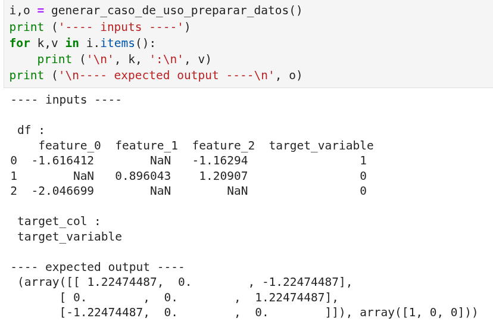
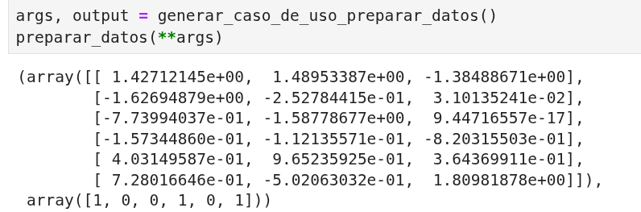

# Ejercicio requerido


El objetivo de este ejercicio es que te familiarices con una metodología rigurosa para usar servicios como [Gemini](gemini.google.com), [ChatGPT](https://chat.chatbot.app/), [Claude](https://claude.ai/chat) o cualquier otro para desarrollar,
validar y comprobar código.

## Tu tarea

Tendrás que plantear cuatro ejercicios, de naturaleza similar a los laboratorios del curso, desarrollar un generador casos de uso para cada problema, y luego desarrollar las soluciones para otros cuatro problemas que generaron tus compañeros. Puedes usar cualquier sevicio de IA para cualquier parte de este proceso.


## Ejemplo

En este ejemplo uso Gemini para crear una pregunta, y también crear el generador de casos de uso.

### Paso 1. Crear una pregunta

Le pido esto a Gemini

    dame una pregunta relacionada con datos y machine learning que tenga que solucionar desarrollando una función de python que use las librerías sklearn, pandas y numpy

Y Gemini me genera esta pregunta


> El Problema:
>
> Recibes un DataFrame de pandas "sucio" que contiene valores numéricos faltantes (NaN) y características en escalas muy diferentes. Debes preparar estos datos para un algoritmo de ML sensible a la escala.
>
> Tu Misión:
> Escribe una función llamada `preparar_datos(df, target_col)` que realice lo siguiente:
> 
> - Separe las características (X) de la variable objetivo (y, especificada por target_col).
>
> - Impute los valores faltantes en X usando el promedio de cada columna (utilizando SimpleImputer de sklearn).
>
> - Escale las características imputadas para que tengan media 0 y desviación estándar 1 (utilizando StandardScaler de sklearn).
>
> - Devuelva dos arrays de numpy: la matriz X procesada y el vector y


Fíjate que la pregunta define exactamente cómo es el nombre de la función a desarrollar (`preparar_datos`), qué argumentos tiene (`df` y `target_col`) y qué tiene que devolver (`X` e `y`)

### Paso 2. Crear el generador de casos de uso.

Un caso de uso en una tupla que contiene

- Un diccionario con valores aleatorios para los argumentos de la función que hay que desarrollar.
- Un objeto Python que se esperaría que devolviera la función que hay que desarrollar al pasarle los valores de los argumentos descritos en el diccionario anterior.

Esto se lo pido a Gemini de esta manera:

    Escribe una función llamada generar_caso_de_uso_preparar_datos en python que devuelva casos de uso aleatorios para la función preparar_datos descrita más abajo. La función que desarrolles no tiene argumentos de entrada y ha de tener dos salidas: input y output. Input ha de ser un diccionario con claves y valores para los argumentos de la funcón preparar_datos. Output ha de ser lo que se esperaría que la función preparar_datos anterior produjera con el input anterior. La función generar_caso de uso, ha de tener un componente aleatorio, de manera que cada vez que se ejecute, genere un par input/output distinto

Y me genera la función siguente. En realidad tuve que revisarla y ajustarla un poco, ya que algunos casos eran triviales.

```python
import pandas as pd
import numpy as np
from sklearn.impute import SimpleImputer
from sklearn.preprocessing import StandardScaler
import random

def generar_caso_de_uso_preparar_datos():
    """
    Genera un caso de prueba aleatorio (input y output esperado)
    para la función preparar_datos.
    """
    
    # 1. Configuración aleatoria de dimensiones
    n_rows = random.randint(5, 15)       # Entre 5 y 15 filas
    n_features = random.randint(2, 5)    # Entre 2 y 5 columnas de características
    
    # 2. Generar datos aleatorios
    # Creamos una matriz de floats aleatorios
    data = np.random.randn(n_rows, n_features)
    feature_cols = [f'feature_{i}' for i in range(n_features)]
    
    df = pd.DataFrame(data, columns=feature_cols)
    
    # Introducimos algunos NaNs aleatorios (aprox 10% de los datos)
    mask = np.random.choice([True, False], size=df.shape, p=[0.1, 0.9])
    df[mask] = np.nan
    
    # Añadimos la columna target (sin NaNs, generalmente)
    target_col = 'target_variable'
    df[target_col] = np.random.randint(0, 2, size=n_rows) # Binario 0 o 1
    
    # ---------------------------------------------------------
    # 3. Construir el objeto INPUT
    # ---------------------------------------------------------
    input_data = {
        'df': df.copy(), # Pasamos una copia para no alterar el original durante el cálculo del output
        'target_col': target_col
    }
    
    # ---------------------------------------------------------
    # 4. Calcular el OUTPUT esperado (Ground Truth)
    #    Aquí replicamos la lógica que debería tener la función preparar_datos
    # ---------------------------------------------------------
    
    # A. Separar X e y
    X_expected = df.drop(columns=[target_col])
    y_expected = df[target_col].to_numpy()
    
    # B. Imputar (Mean)
    imputer = SimpleImputer(strategy='mean')
    X_imputed = imputer.fit_transform(X_expected)
    
    # C. Escalar (StandardScaler)
    scaler = StandardScaler()
    X_scaled = scaler.fit_transform(X_imputed)
    
    output_data = (X_scaled, y_expected)
    
    return input_data, output_data

# --- Ejemplo de uso ---
if __name__ == "__main__":
    # Generamos un caso
    entrada, salida_esperada = generar_caso_de_uso()
    
    print("=== INPUT (Diccionario) ===")
    print(f"Target Column: {entrada['target_col']}")
    print("DataFrame (primeras 5 filas con posibles NaNs):")
    print(entrada['df'].head())
    
    print("\n=== OUTPUT ESPERADO (Tupla de arrays) ===")
    X_res, y_res = salida_esperada
    print(f"Shape de X procesada: {X_res.shape}")
    print(f"Shape de y: {y_res.shape}")
    print("Ejemplo de primera fila escalada:", X_res[0])
```

### Paso 3. Comprueba la función generadora

Para ello uso un notebook. Si corro la función me genera esto.




### Paso 4. Comprueba la llamada a una función solución

Con la la salida de la función generadora de casos de uso, tengo que poder llamar directamente a la función solución. Fíjate que gracias a esto se puede automatizar la generación de pruebas de casos de uso y su evaluación.




## Requisitos

- Tienes que generar cuatro preguntas, al menos dos de ellas tienen que implicar el uso de `pandas` y otras dos el uso de `sklearn`.
- La pregunta ha de especificar qué nombre ha de tener la función que hay que crear para resolver el problema.
- La función generadora de casos de uso 
    - ha de llamarse `generar_caso_de_uso_[nombre_de_funcion]` (sin los corchetes), donde `nombre_de_funcion` es el nombre de la función que resuelve el problema. Como `generar_caso_de_uso_preparar_datos` más arriba.
    - ha de tener un componente aleatorio, de manera que cada vez que se invoque genere un caso de uso distinto

## Envío de preguntas y soluciones

El proceso de participación de cada estudiante se hará en dos fases

**FASE 1**: Tendrás que crear preguntas y sus generadores de casos de uso. Para la entrega de la fase 1 tendrás que:

1. Crear un repositorio github con la siguiente estructura

        +- README.md
        +- myquestions
            +
            +- question-001.txt
            +- question-001-usecase-generator.py
            +- question-002.txt
            +- question-002-usecase-generator.py
            +- question-003.txt
            +- question-003-usecase-generator.py
            +- question-004.txt
            +- question-004-usecase-generator.py

en donde 

- `README.md` deberaé de tener al menos tu nombre y dirección de correo institucional
- `question-XXX.txt` deberá de tener el texto de la pregunta, que ha de ser el mismo que tienes que registrar en el formulario más abajo.
- `question-XXX-usecase-generation` deberá de contener la función generadora de casos de uso aleatorios.

2. Rellenar [este formulario](https://forms.gle/5bforw4AnbqG6Sbq9) en donde indicarás la dirección de tu repo github y registrás tus preguntas.

**FASE 2**: Se te asignarán cuatro preguntas creadas por otros compañeros y tendrás que crear la función que soluciona cada pregunta. Para ello tendrás que usar la función que genera los casos de uso asociada a cada pregunta.


## Sólo para estudiantes de Ingeniería de Sistemas

Si ya has pasado (aprobado) el contenido de IA en un semestre anterior tienes que hacer el proyecto sustituto

<br/>


## Sesiones temáticas
 
 Sesiones complementarias que se realizaron en semestrens pasados y son de interés general.

- Introducción a Github <a href='https://youtu.be/KOFtvWm55mo'>Sesión de clase Semestre 2025-1, Abril 2025</a>
- Introducción a Docker <a href='https://youtu.be/Q4wH6Ddcr2U'>Sesión de clase Semestre 2025-1, Mayo 2025</a>
- Descripci{on proyecto Kaggle 2025.1 <a href='https://www.youtube.com/watch?v=7jYoyDpKzno'>Sesión de clase Semestre 2025-1</a>
- Cómo hacer disponibles los datos de la competencia de Kaggle en Google Colab <a href='https://www.youtube.com/watch?v=I9VLPqP97b4'>Video 11mins</a>
- Experiencias en ejecución de proyectos de IA <a href='https://www.youtube.com/watch?v=Wpj80tZXZwc'>Video 1h 17mins</a> (29 Ago 2023)


## AI for Everyone

Te recomendamos completar o visualizar el curso [AI for Everyone](https://www.deeplearning.ai/ai-for-everyone/) 
