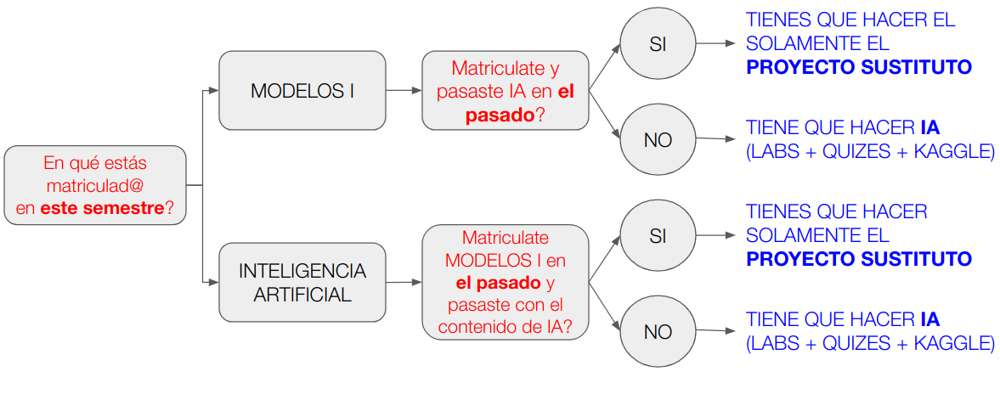

# Proyecto sustitutorio Modelos 1

Esta es información para los estudiantes de Ingeniería de Sistemas, que ya han visto previamente el contenido la electiva de Inteligencia Artificial.

 

## Horario de clases
    
        MARTES 10:00-12:00          JUEVES 10:00-12:00

 

Las sesiones se realizarán por Zoom a través del siguiente enlace compteción

<big><a href="https://udea.zoom.us/j/97037396150">https://udea.zoom.us/j/97037396150
</a></big>

 

**Grabaciones**: Accede en [este enlace](https://ingenia.udea.edu.co/zoom/meeting/97037396150) al repositorio de grabaciones de las sesiones sincrónicas del curso.
 

## Estructura de proyecto

El objetivo del proyecto es completar la formación anterior llevando un modelo predictivo a un estado listo para que sea integrado en sistema de producción. 

El proyecto tendrá tres fases:

**FASE 1. Modelo predictivo**:
- Escoge un challenge de Kaggle. Mejor si es una competición y no un dataset, ya que las competiciones son más completas y tienen más contribuciones de código. Se recomiendo escoger algún dataset relacionado con el transporte personal (Taxis, Uber, etc.), para que haya una posibilidad futura de ser integrado en los proyectos de la Escuela de Software. Pero no es obligatorio.
- Desarrolla o replica un modelo predictivo para el challenge. Puedes desarrollarlo tú mismo, o puedes seleccionar algún modelo que alguien ya haya realizado mirando la parte de **code** de Kaggle. 
- No te preocupes si las predicciones no son muy precisas. Lo importante es que emita predicciones.

**FASE 2. Despliegue en container**:
- Configura un contenedor de Docker con todas las librerías necesarias para correr el modelo.
- El contenedor ha de tener dos scripts:
  - `predict.py`: que dado un conjunto de datos de entrada como un fichero `csv`, emita una predicción para cada dato de entrada, usando un modelo previamente almacenado en disco.
  - `train.py`: que dado un conjunto de entrenamiento (datos más etiquetas), entrene de nuevo el modelo y guarde una versión nueva del mismo.
- Para estos dos scripts puedes guiarte por el ejemplo en [https://github.com/rramosp/sklearn_scripts](https://github.com/rramosp/sklearn_scripts)

**FASE 3. API REST**:
- Crea una aplicación REST en un script **python** `apirest.py` (p.ej. con `flask`) que exponga dos `endpoints`:
  - `predict`: que con un dato nuevo devuelve su predicción
  - `train`: que lanza un proceso de entrenamiento, con unso datos de entrenamiento estándar.
- Para esta fase puedes guiarte con este repo [https://github.com/rramosp/restapiexample](https://github.com/rramosp/restapiexample)
    

 

## Sesiones temáticas

- Introducción a Github <a href='https://youtu.be/KOFtvWm55mo'>Sesión de clase Semestre 2025-1, Abril 2025</a>
- Introducción a Docker <a href='https://youtu.be/Q4wH6Ddcr2U'>Sesión de clase Semestre 2025-1, Mayo 2025</a> 
- Experiencias en ejecución de proyectos de IA <a href='https://www.youtube.com/watch?v=Wpj80tZXZwc'>Video 1h 17mins</a> (29 Ago 2023)

 

## Entregas

El proyecto se podrá realizar **individualmente** o **por parejas**. En cualquier caso, cada persona es responsable de su entrega. Si es en parejas, **ambas personas** han de hacer su entrega por separado, aunque el contenido sea el mismo. Si un miembro de una pareja no hace la entrega, no tendrá nota, independientemente de si su pareja entregó o no.

Tendrás que entregar tu proyecto en un repositorio de github, que contenga:
- Un directorio `fase-1`, con al menos un notebook que muestre cómo se entrena y se predice con el modelo
- Un directorio `fase-2`, con los scripts `predict.py` y `train.py` y un `Dockerfile` para crear el contenedor con las librerías y los scripts anteriores incluidos  
- Un directorio `fase-3`, con los scripts anteriores, más `apirest.py`, más `client.py` que ilustre cómo se llama al api desplegado sobre docker programáticamente, más un `Dockerfile` nuevo que extienda el anterior para instalar todo lo necesario para el API REST.

Añade un `README.md` al repositorio github donde se describan los pasos para ejecutar cada elemento de cada fase.

Se recomienda que uses el mismo repositorio para todas tus entregas, de forma que, a lo largo del curso, lo vayas poblando con los directorios `fase-1`, `fase-2`, `fase-3`.

## Formularios para las entregas

- Fase 1: [FORMULARIO de ENTREGA](https://forms.gle/RCttF4L1ZPY6xkGM9)
- Fase 2: [FORMULARIO de ENTREGA](https://forms.gle/qYRc13Q5vaLDRJJq9)
- Fase 3: [FORMULARIO de ENTREGA](https://forms.gle/e7X1zovtgJj4BaGr8)

## Fechas

    FASE 1:  5/oct
    FASE 2:  2/nov
    FASE 3: 23/nov

## Evaluación

    FASE 1: 40%
    FASE 2: 40%
    FASE 3: 20%

Para cada fase se evaluará:
  - 10% que los elementos de la entrega estén presentes (ficheros, github, etc.)
  - 50% que siguiendo el `README.md` se ejecuten correctamente los elementos de las entregas. Se seguirán paso a paso las instrucciones. Se penalizará cualquier paso que haya que dar que no esté descrito en el fichero. 
  - 40% que tanto el notebook, como los scripts como los dockerfiles estén bien documentados. Es decir:
      - Que el notebook explique brevemente qué hace cada celda.
      - Que los scripts y las funciones tengan sus correspondientes `docstrings`
      - Que los dockerfiles tengan un comentario adjunto a cada línea de código.

