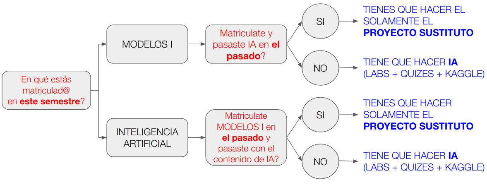

# Proyecto sustitutorio Modelos 1 - GRUPO B

Esta es información para los estudiantes de Ingeniería de Sistemas, que ya han visto previamente el contenido la electiva de Inteligencia Artificial.

 

## Horario de clases

El curso tendrá sesiones sincrónicas dos veces por semana, de acuerdo con el grupo matriculado:

- **Grupo 3:** Miércoles y viernes, **14:00 – 16:00**
- **Grupo 1:** Miércoles y viernes, **18:00 – 20:00**

 

## Sesiones por Zoom

Las clases se realizarán mediante **Zoom**. Cada grupo deberá conectarse utilizando el enlace correspondiente a su horario.

### Grupo 3 — Miércoles y viernes, 14:00 – 16:00

<big>
<a href="https://udearroba.zoom.us/j/96791942977">
Miércoles y viernes 14:00–16:00
</a>
</big>

 

### Grupo 1 — Miércoles y viernes, 18:00 – 20:00

<big>
<a href="https://udearroba.zoom.us/j/97069112747">
Miércoles y viernes 18:00–20:00
</a>
</big>

 

# Guía del Proyecto Integrador
## Modelos y Simulación de Sistemas I

## 1. Introducción
Durante el semestre desarrollarás un proyecto integrador cuyo objetivo es llevar un modelo de Machine Learning desde un notebook hasta un prototipo desplegable. El énfasis del curso no es obtener el mejor modelo, sino aprender a convertirlo en una solución reproducible, organizada y preparada para integrarse con otros sistemas.

El proyecto será acumulativo; por lo tanto, cada entrega deberá conservar y ampliar el trabajo desarrollado en las entregas anteriores.

El proyecto se realizará en **parejas o grupos de tres estudiantes**. Nadie podrá trabajar de forma individual.

## 2. Objetivo
Desarrollar un modelo predictivo y convertirlo en un prototipo reproducible, contenerizado y accesible mediante una API REST, incorporando principios básicos de monitoreo y gestión del modelo.

## 3. Organización del proyecto
El proyecto se desarrollará durante todo el semestre y estará dividido en cuatro fases:

1. Modelo predictivo.
2. Scripts y Docker.
3. API REST.
4. Monitoreo básico.

Cada fase utiliza el trabajo realizado en la anterior y deberá conservar los entregables desarrollados previamente.

## 4. Selección del problema
Cada equipo deberá seleccionar preferiblemente una **competición de Kaggle**.

Se recomienda trabajar con problemas relacionados con movilidad o transporte, aunque no es obligatorio.

El conjunto de datos deberá cumplir, como mínimo, las siguientes características:

- Tener una variable objetivo claramente definida.
- Corresponder a un problema de clasificación o regresión.
- Contener al menos **1.000 observaciones**.
- Contener al menos **5 variables predictoras** (sin contar la variable objetivo).
- Incluir variables numéricas o categóricas que puedan ser utilizadas para entrenar un modelo de Machine Learning.
- Poder procesarse en un computador personal sin requerir infraestructura especializada.

Antes de iniciar el desarrollo del proyecto, cada equipo deberá enviar al correo electrónico del curso un informe con la descripción del problema seleccionado y la justificación de su elección. El proyecto solo podrá iniciarse una vez el profesor apruebe dicho informe.

# 5. Fase 1 – Modelo predictivo

## Objetivo
Construir o adaptar un modelo de Machine Learning capaz de realizar predicciones.

### ¿Qué debe hacer?
- Explorar y preparar los datos.
- Desarrollar o adaptar un modelo predictivo.
- Evaluarlo.
- Evitar fuga de información.
- Guardar el modelo.

### ¿Qué debe entregar?
- Carpeta fase-1
    - Notebook ejecutable.
    - Modelo almacenado.
    - README actualizado.

# 6. Fase 2 – Scripts y Docker

## Objetivo
Transformar el trabajo realizado en la Fase 1 en una aplicación reutilizable que pueda entrenarse y generar predicciones desde la línea de comandos. En esta fase el objetivo no es desarrollar un nuevo modelo, sino convertir el modelo construido en la Fase 1 en una aplicación reutilizable.

### ¿Qué debe hacer?
- Implementar `train.py`.
- Implementar `predict.py`.
- Crear un Dockerfile.
- Versionar el modelo.
- Implementar pruebas básicas con pytest.

### ¿Qué debe entregar?
- Carpeta fase-2.
    - train.py
    - predict.py
    - Dockerfile
    - README actualizado.

# 7. Fase 3 – API REST
En esta fase se utilizará el trabajo desarrollado en las fases anteriores para exponer el modelo mediante una API REST.

## Objetivo
Publicar el modelo mediante un servicio REST.

### ¿Qué debe hacer?
- Crear una API REST.
- Implementar `/health`, `/predict` y `/train`.
- Validar entradas.
- Manejar errores básicos.
- Implementar pruebas.

### ¿Qué debe entregar?
- Carpeta fase-3.
    - Dockerfile actualizado.
    - README actualizado.
- API funcionando.
- Cliente de prueba.

# 8. Fase 4 – Monitoreo
En esta fase se ampliará la API desarrollada en la fase anterior incorporando mecanismos básicos de monitoreo y gestión del modelo.

## Objetivo
Implementar mecanismos básicos para supervisar el funcionamiento del modelo.

### ¿Qué debe hacer?
- Registrar predicciones.
- Mostrar métricas básicas.
- Mantener versiones del modelo.
- Definir una política sencilla de reentrenamiento.

### ¿Qué debe entregar?
- Carpeta fase-4
    - Script de monitoreo.
    - Reporte.
    - Política de reentrenamiento.

Los entregables anteriores corresponden a los requisitos mínimos. Los detalles técnicos y entregables adicionales se describirán en la Especificación Técnica del Proyecto.

# 9. GitHub
Todos los integrantes deberán realizar contribuciones al repositorio durante el desarrollo del proyecto.

- Un único repositorio por equipo.
- Uso de ramas.
- Al menos un Pull Request.
- README actualizado.
- Participación de todos los integrantes.

# 10. Evaluación

El proyecto se desarrollará mediante tres entregas parciales durante el semestre.

- **Entrega 1:** Fase 1 – Modelo predictivo.
- **Entrega 2:** Fase 2 – Scripts y Docker.
- **Entrega 3:** Fases 3 y 4 – API REST y Monitoreo.

La evaluación del proyecto corresponde al **40 %** de la nota final del curso.

| Entrega | Fases | Valor |
|----------|--------|------:|
| Entrega 1 | Fase 1 – Modelo predictivo | 5 % |
| Entrega 2 | Fase 2 – Scripts y Docker | 15 % |
| Entrega 3 | Fases 3 y 4 – API REST y Monitoreo | 20 % |

| Criterio | Peso |
|----------|------:|
| Entregables | 10 % |
| Funcionamiento | 30 % |
| Calidad técnica | 25 % |
| Pruebas | 15 % |
| Documentación | 15 % |
| Trabajo colaborativo | 5 % |

Los detalles técnicos serán publicados posteriormente en la Especificación Técnica del Proyecto.

# 11. Cronograma

| Fecha | Actividad |
|--------|-----------|
| 03/sep/2026 | Laboratorios módulos 1 y 2 |
| 15/sep/2026 | **Entrega 1 – Modelo predictivo** |
| 15/oct/2026 | Laboratorios módulos 3 y 4 |
| 31/oct/2026 | **Entrega 2 – Scripts y Docker** |
| 15/nov/2026 | Laboratorios módulos 5, 6 y 7 |
| 22/nov/2026 | **Entrega 3 – API REST y Monitoreo** |

# 12. Recursos

### Curso base

- **Inteligencia Artificial para las Ciencias e Ingenierías**  
  https://rramosp.github.io/ai4eng.v1/

### Repositorios de apoyo

- **Scripts de referencia para modelos en Scikit-learn**  
  https://github.com/rramosp/sklearn_scripts

- **Ejemplo de API REST para modelos de Machine Learning**  
  https://github.com/rramosp/restapiexample

### Material complementario

- **Introducción a GitHub** – Sesión de clase (Semestre 2025-1, abril de 2025)  
  https://youtu.be/KOFtvWm55mo

- **Introducción a Docker** – Sesión de clase (Semestre 2025-1, mayo de 2025)  
  https://youtu.be/Q4wH6Ddcr2U

- **Experiencias en la ejecución de proyectos de Inteligencia Artificial** – Video (1 h 17 min, 29 de agosto de 2023)  
  https://www.youtube.com/watch?v=Wpj80tZXZwc

El resto de los recursos del curso serán publicados durante el semestre.

# 13. Consideraciones finales

El objetivo del proyecto no es únicamente desarrollar el modelo más preciso, sino construir una solución reproducible, organizada y preparada para ser utilizada por otras personas o integrada en aplicaciones de software.

La documentación técnica detallada de cada fase será publicada durante el semestre mediante la **Especificación Técnica del Proyecto**.

## Formularios para las entregas

- Fase 1: [FORMULARIO de ENTREGA](https://forms.gle/7hiUfGA1i3g151LD8)
- Fase 2: [FORMULARIO de ENTREGA](https://forms.gle/6wAqocTCMKYbBL7G6)
- Fase 3: [FORMULARIO de ENTREGA](https://forms.gle/oQjwMv3hPR9gpBxh7)

 
